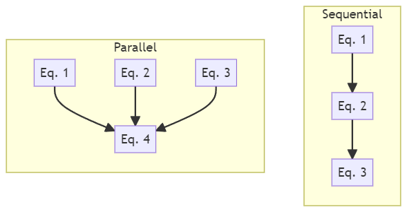

# First Meeting Agenda

Edit this page as the meeting note for the first (technical) meeting between the developer and the domain expert. If all goes well, this should be the only time that you will need to find common time for a meeting. Aim for one hour, but depending on the complexity of the problem, this may take longer or multiple sessions.

Before the meeting, the developer should inform the domain expert to register for a **GitHub account** and prepare a **short presentation** (does not have to be formal) on their work and the problem they are facing, which they hope that the software can help solve.

During the meeting, the developer should take notes under each (applicable) question based on their understanding of the domain expert's response. The domain expert is encouraged to provide immediate feedback, but will be also be given the chance to review the note afterward and make corrections. However, this should only happen in the immediate days following the meeting in case they have given more thoughts and have more to add. After that, the developer will process to write formal documentations based on the notes, and any attention should be directed to those documents.

This page is informal and will eventually be hidden along with the `Template Guide` section of the website.

## Meeting Start
- People introducing themselves and their roles.
- Developer:
    - Add the domain expert to your GitHub repository as a collaborator.
    - Let them know they can edit any document by clicking the `Edit this page` button on the top right.
    - Let them know they can open issues regarding any section of a page by clicking the `✉` icon next to the section title.   
      (They should change the automated issue title to something more descriptive.)
- Domain Expert:
    - Give their short presentation.

!!! tip  
    The `Report an issue` button exists on the right side of each question.

## Problem Domain
!!! info  
    The first questions are to gather some resources for getting a basic understanding of the problem domain.  
    These can be informal/non-academic sources like online articles and videos just to help the developer get a sense of the problem domain.  
    We should not spend too much time on this as more specific questions will be asked later.
#### If I were to understand more about the problem domain, what keyword should I search for?

#### Is there any literature review, general overview paper or book chapter that you would recommend?

## Software Goals

!!! info  
    The developer may already have a general idea of what problem the domain expert wants to solve with the software at this point.
    If so, we can simply voice our understanding and ask for confirmation.

#### Give your understanding of the problem that the software is trying to solve.
> Let the domain expert confirm or correct your understanding.  
> Otherwise, move to the next question.

#### Can you clarify what are we trying to achieve with the software?

#### At the very minimum, what should the software be able to do to be useful to its users?
> Communicate the idea of a minimum viable product (MVP) to the domain expert.

#### Are there any special requirements in terms of usage?
> Such as...

> - A graphical user interface (GUI) is preferred over command line (CLI).
> - Must be a library that can be imported into other projects.
> - Must be able to interface with certain software/workflow.
> - Plan to run on computing clusters.

> The developer may need to help the domain expert to understand the implications of these requirements.  
> For example, you cannot have a GUI and want to run on a computing cluster.

## Theoretical Models

!!! info  
    This is the foundation of the software, so spend more time here if needed.  
    Note that the goal of the developer is to gain an understanding of the model enough to implement it in software, not a research-level understanding, which may take too much time.

#### Regarding the model you are working on, is there a paper or book or your own writing that I should read to gain a basic understanding of WHAT it is and HOW it works
> Without going into WHY it works.  
> It could already be included in the previous suggested readings.

#### Which sections or chapters should I focus on?

#### Which equation or set of equations is the core of the model?

- If there are multiple questions, what are their relationships/order of calculation? (See figure below for two typical examples)
- Are there any terms/symbols in the equations that is not defined in the literature, but more of common knowledge in the field?

  
/// caption  
Typical parallel and sequential calculation  
///  
> Note that this is purely a discussion of the theoretical models structure, and not yet about software implementation

#### Are there any variations (different forms) of these equations that I should be aware of?

#### For your own research or our software implementation, are there any modification to the equations from the original literature?

#### Are there any simpler, better-understood models, perhaps less accurate models to the same problem? 
> We can potentially use them for testing purposes.

## Scale of the Problem

!!! info  
    The scale of the problem and any performance expectations are may influence the software design.
    Thus, it is important to gather this information early on so that the developer and domain expert stays on the same page.

#### When using the model for actual problem-solving, how is the model invoked? 
> Once per input/data point or many times in series/parallel to approach a solution?

#### In a typical use case, what is the approximate scale of the problem. 
> Depending on the problem/model, this can be in terms of: 

> - Number of data points
> - Matrix/vector/meshgrid size
> - Simulation length and time step
> - Data rate expected to flow through the software (for a real-time application)
> - Number of iterations/steps or until what state can the result be considered acceptable

#### Given the problem scale, is there any performance expectations or metric that we should be aware of? 
> The domain expert may not have a clear idea of this, and we may only be able to get a better picture after the proof of concept is phase.  
> But nonetheless we should record the initial response.

## Data and Inputs/Outputs

!!! info  
    Real world values can be messy and may not always be available in the format that the model requires.  
    The domain expert should consider when they are using the software, what can they realistically provide as input.  
    If there is "educated guess" involved, that could influence their research.

#### Does the model require any additional data to function? 
> This can be fixed or tabulated coefficients, tweaking parameters, etc.
> - If so, is the user responsible to provide these for their specific use case, or should we include them in the software?
> - If we were to include them in the software, where do we get these data from? Are they from any literature, your own experiments, etc.?

#### Ideally, what should the user provide as inputs?

#### Realistically, what can we currently expect the user to be able to provide as inputs? 
> If they have difficulty providing some inputs, what should we do (e.g. default values, derive from other inputs, etc.)?

> - How does solution quality degrade if some inputs are not provided (if this is known)?
> - If the method to treat missing input is non-trivial, we should ask for examples, literatures, or even treat them a separate theoretical model.
    \end{itemize}
#### What does the user expect as output from the software? 
> Does the user want any additional information like accuracy, intermediate results or metrics, etc.?

#### Are the input and output directly to and from the model? 
> Or are there any pre-processing or post-processing steps that the software need to do?   
> If these are non-trivial steps, we should again ask for examples, literatures, or even treat them a separate theoretical model.

## Testing
#### If you were to use the software in your research, what would you give as typical inputs (or input ranges)?
> It will be even better if expected output can also be provided, but this mostly likely will not be the case, except some very simple/degenerate special cases.

#### Are you aware of any (pseudo)oracles that we can use for testing?
> These can be...  

> -  Known to work implementations. If not on our main model of interest, perhaps on a simpler model that you mentioned earlier.
> -  Analytical solutions, if they exist, even on a simpler model.
> -  Experimental data that we can adapt into input/output pairs.

#### What are some general trends or patterns we can expect from the model given different inputs?

#### If other models are provided, how do you expect the results to differ in certain special cases?

#### Are there any simple/degenerate/special cases that we can use to test the software?

## Finishing Remarks
Domain expert, please give any feedback on the notes either now or in the next few days. The developer will then proceed to write formal documentation based on these notes.

#### Question to the domain expert
Based on all the questions asked and information you have provided, are you confident that the developer will have a good understanding of the problem domain and the model to implement the software?  

Do you think there is still any gap in information that we need to fill?
